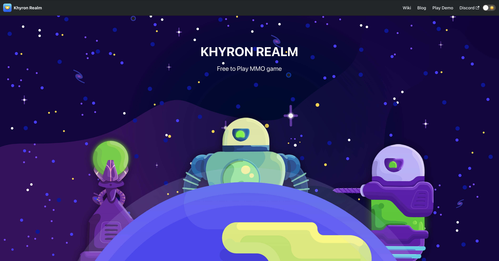

<!-- PROJECT LOGO -->
<br />
<p align="center">
  <a href="https://github.com/target-software/game-website">
  </a>

  <h3 align="center">KHYRON REALM</h3>

  <p align="center">
    README for the Khyron Realm Game Website
    <br />
    <a href="https://github.com/target-software/game-website"><strong>Explore the docs »</strong></a>
    <br />
    <br />
    <a href="https://khyron-realm.com">View Demo</a>
    ·
    <a href="https://github.com/target-software/game-website/issues">Report Bug</a>
    ·
    <a href="https://github.com/target-software/game-website/issues">Request Feature</a>
  </p>
</p>



<!-- TABLE OF CONTENTS -->
<details open="open">
  <summary>Table of Contents</summary>
  <ol>
    <li>
      <a href="#about-the-project">About The Project</a>
      <ul>
        <li><a href="#built-with">Built With</a></li>
      </ul>
    </li>
    <li>
      <a href="#getting-started">Getting Started</a>
      <ul>
        <li><a href="#installation">Installation</a></li>
      </ul>
    </li>
    <li><a href="#roadmap">Roadmap</a></li>
    <li><a href="#references">References</a></li>
  </ol>
</details>


<!-- ABOUT THE PROJECT -->
## About The Project

Khyron Realm presentation website

### Built With

This website is built using:

* [Docusaurus 2](https://docusaurus.io/): a modern static website generator.

<!-- GETTING STARTED -->
## Getting Started

### Installation

1. Installation
```
$ yarn
```
2.Local Development
```
$ yarn start
```
This command starts a local development server and opens up a browser window. Most changes are reflected live without having to restart the server.

3. Build
```
$ yarn build
```
This command generates static content into the `build` directory and can be served using any static contents hosting service.

<!-- ROADMAP -->
## Roadmap

See the [open issues](https://github.com/target-software/game-website/issues) for a list of proposed features (and known issues).


<!-- REFERENCES -->
## References

1. [Docusaurus](https://github.com/facebook/docusaurus)
1. [RunletApp](https://github.com/runletapp/website)
1. [HaochenQ](https://github.com/HaochenQ/Haochen-Blog)
